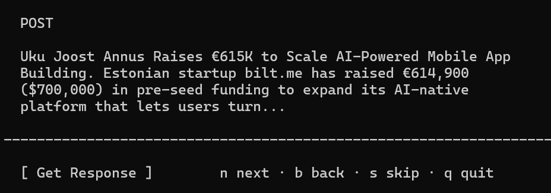
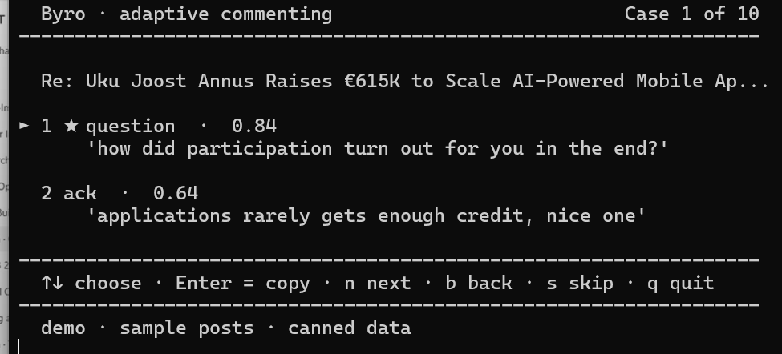
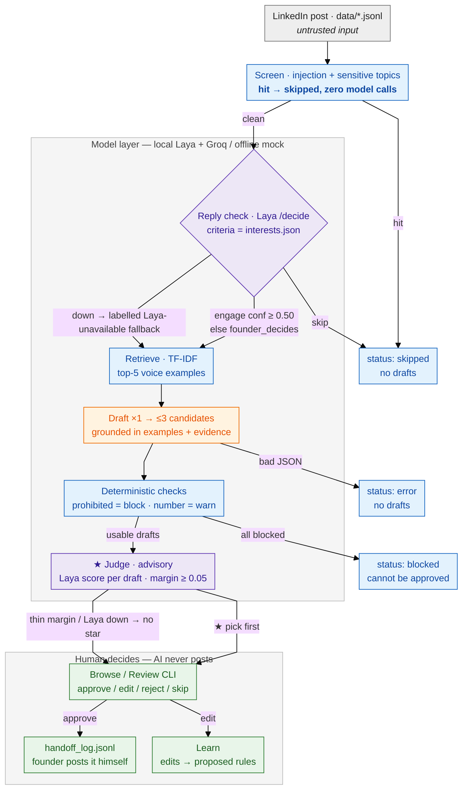

# Adaptive LinkedIn commenting — Byro technical challenge

A small, honest agent loop that helps a founder (Rico Soots) decide **when** to
comment on a LinkedIn post, propose a comment **in his voice**, and improve from
his edits — while he stays in control of every word that would ever be posted.

**Laya** — the local model this project uses for its decisions — is the
alternative to **Jev**.

> One small loop, one local model, nothing deployed. Nothing in this repo
> can post to LinkedIn, log in, or scrape.

## Start it locally (2 minutes)

```bat
git clone https://github.com/Pranshu23x/byro-challenge.git
cd byro-challenge
byro.cmd demo    :: first run also builds .venv + .env — the 60s tour
byro.cmd run     :: generates 10 cases into runs/proposals.jsonl
byro.cmd browse  :: the picker — press Enter on [ Get Response ]
```

One file (`byro.cmd`) bootstraps everything: no make, no `-ExecutionPolicy`
flags, no keys required (the default provider is the offline mock). The ★
scores appear when the local Laya service is running (one command — see
[§3](#3-runnable-proof)); without it, everything still works and says so
honestly. macOS/Linux: `make setup && make demo` (and the other `make …`
targets below).

*Screenshot (to add): the 60s demo screen — drop the file at
`docs/screenshots/demo.png`.*

## 1. Product definition

**Full text:** [`docs/product.md`](docs/product.md) — this section is the
summary.

### Premise challenged (with user evidence)

The brief frames the need as *contributing consistently*. The founder's own
activity argues otherwise: he already comments heavily (18 real pairs in the
dump) and skips plenty of posts on purpose. His actual pain isn't habit or
volume — it's **picking the right moment** and **not sounding like AI when he
does reply**. So the product leads with the **reply check** — *should he
comment at all?* (staying silent is half the value) — and treats drafts as
candidates he may reject, not as throughput.

### User evidence

Rico Soots, 19, founder of Byro, Tallinn — provenance for every fact in
[`data/SOURCES.md`](data/SOURCES.md):

- **18 real comment pairs** — his comments on others' posts. Voice: 1–6
  words, lowercase, playful, never "Great post!".
- **His own posts + public profile** — what he talks about, how he phrases
  offers.
- **Derived interest map** — 13 topics weighted by what he demonstrably
  replies to, each with its evidence string.

Why he engages: visibility for Byro, useful to founder peers, hiring, genuine
interest in the Estonian startup scene. Valuable *to him*: short, specific,
adding a real angle — not applause.

### The one narrow loop

```
post in  ->  should he reply?  ->  1-3 draft comments in his voice
          (reply check)               (grounded in his claims + examples)
        ->  the judge stars its style-fit best (★, advisory — accuracy in D10)
        ->  HE approves / edits / rejects  ->  he posts it himself (handoff)
        ->  his edits teach accepted voice rules  ->  better next drafts
```

One post at a time, batch of 10 per run. Nothing else.

### Success signal

1. **Reply-check agreement** — our engage/skip calls match his labels;
   *confident-and-wrong* must be 0 (`reports/eval_report.md`).
2. **Blind holdout judgments** — 7 posts he has never seen labeled; answer key
   sealed until he answers (`make eval`).
3. **Edit distance shrinking** — fewer rewrites before approval over sessions;
   his edits become rule-sized, versioned, rollback-able (`make learn`).

### When the system must do nothing

| Condition | Behavior |
|---|---|
| injection / sensitive post | skipped *before* any model sees it |
| model confidence below threshold | `founder_decides` — drafts attached, never auto-picked |
| model error / unparseable JSON | status `error`, **zero drafts** (no guessed text) |
| every draft hits a prohibited-claim block | status `blocked`; blocked drafts cannot be approved |

### Non-goals (explicitly out of scope)

- Auto-posting, scheduling, LinkedIn login/scraping/browsing of any kind
- Multi-user, teams, multi-platform, analytics dashboards
- An "always engage" autopilot — the human decides each time
- Inventing facts or engagement bait — claims must come from the post or
  `evidence.md`
- Production infra: auth, billing, deployment (per brief)

### Riskiest assumption (what architecture alone cannot prove)

> **That a system-drafted comment will read as *him*.** Tests prove the
> screens fire, the holdout never leaks, rules version and roll back — none of
> that proves he'll accept a draft without rewriting it, or can't tell it from
> his own. Voice acceptance is only provable by him, blind. The thin proof:
> `make eval` → `reports/review_packet.md` (7 holdout posts + one of his real
> comments mixed in, answer key sealed).

*Screenshot (to add): the blind holdout packet — drop the file at
`docs/screenshots/review-packet.png`.*

## 2. System design

**Full text:** [`docs/system-design.md`](docs/system-design.md) (diagram,
state model, AI/human boundaries, trade-offs) — this section is the summary.

### The approach, in plain words

To solve this problem we applied one simple approach: **pull the founder's
previous comments → ask the LLM to generate a list of comments he might reply
with → use Laya to score them and pick the one that sounds most like him.**
Everything below is that one idea in detail.

All of it starts with what the founder actually does. His real LinkedIn
comments were pulled out **by hand** from the activity dump he gave us — no
scraping, no login, nothing in this repo touches LinkedIn — and they become
the founder's context: examples of how he writes, a map of what he cares
about, and a list of things he never talks about.

That context is fed back into the model in two places, and that's the whole
architectural idea:

1. **His context answers "should he reply?"** Instead of asking a model "is
   this post interesting?" in the abstract, we compile his interest map into
   the **criteria** the post is scored against — the local Laya service
   answers "is this something *he* would care about?" and how confidently.
2. **His context writes the comment.** The writing model (Groq's Llama, or
   the offline mock) gets his profile, the claims he's allowed to make, and a
   few of his real comments as style examples, then writes up to three
   candidate replies — each with a response type: a question, an
   acknowledgment, a story.

Then the judge reads the three back and ranks them on one question: *how
familiar does this sound — would he actually type it?* The most familiar one
gets the ★ and jumps to the top of the list. That pick is advisory
(`decision-log.md` D10 publishes exactly how good it actually is); the last
step is always the human — arrow keys, Enter, and the comment lands in his
clipboard to paste into LinkedIn himself.

**Example post** — a feed post (from the founder or anyone) that Rico Soots
wants to comment on; nothing is shown until he presses Get Response:



**Responses** — the LLM wrote the replies from Rico's previous comments;
option 1 is Laya's top pick (★, 0.84), option 2 the next one:



#### What is Laya, and why is it here?

- **What:** a small local model served on `localhost:8080` (separate Slime
  checkout, one command — see §3).
- **Use case:** two calls — the *reply check* (scores the post against his
  interest map: should Rico reply at all?) and the *judge* (scores each
  generated comment for style fit; the top score gets the ★).
- **Why it's important:** decisions stay on-device, cheap, and grounded in
  *his* evidence — and it's the signal that says which generated comment
  sounds like Rico instead of like a generic LLM.

### Primary flow

1. **Posts** — 10 example posts from files (`data/*.jsonl`), treated as
   untrusted input.
2. **Screen** — simple text checks (attack patterns, sensitive topics) run
   *before* any model; hits are skipped with zero model calls.
3. **Reply check** — Laya scores the post against his interests and returns
   engage / skip / founder_decides + a confidence number.
4. **Retrieve** — pulls up to 5 of his past comments most similar to the
   post (they steer the writing style).
5. **Draft** — the writing model writes up to 3 candidates from the post,
   his profile, and allowed claims; forbidden claims or made-up numbers are
   blocked automatically.
6. **Rank** — Laya scores how familiar each candidate sounds; the best gets
   the ★ (advisory — no star when it's unsure or the service is down).
7. **Decide** — he picks in `browse` (arrows, Enter = copy + approve) or
   `review`; his edits become rule proposals (`learn`).
8. **Handoff** — the approval is saved to `runs/handoff_log.jsonl`; **he
   pastes it into LinkedIn himself.** Nothing in this repo can post.

### Architecture



Grey = untrusted input · blue = deterministic (no model) · purple = local
Laya · orange = drafting model · green = the founder. His accepted edits
become versioned `rules.yaml` entries that feed back into drafting.

### Core state & data model (all files, all inspectable)

| State | Where | Notes |
|---|---|---|
| `drafted` | `runs/proposals.jsonl` | ≥1 usable draft; ready to decide |
| `founder_decides` | same | confidence thin — drafts attached, never auto-picked |
| `skipped` / `error` / `blocked` | same | zero drafts; nothing to approve |
| decisions (approve/edit/reject/skip) | `runs/decisions.jsonl` | append-only |
| approvals ("handoff") | `runs/handoff_log.jsonl` | the mock external action |
| accepted voice rules | `rules/rules.yaml` | versioned, one-command rollback |
| founder context | `data/founder/*`, `data/voice_examples.jsonl`, 7-item holdout | provenance in `data/SOURCES.md`; holdout never enters prompts (test-enforced) |

### What AI may and may not decide

- **May:** the reply-or-skip suggestion + confidence, draft candidates,
  style-fit scores (★ is advisory), proposed rules from his edits.
- **May not:** post anything, approve anything, decide alone when confidence
  is thin (→ `founder_decides`), touch the holdout, invent claims (blocked
  deterministically).

### Safety rails (enforced by tests, not just promised)

- **No LinkedIn anything** — no credentials, scraping, browser automation, or
  network calls toward LinkedIn. Input is files in `data/`.
- **No external actions** — approvals are appended to
  `runs/handoff_log.jsonl`; *the human posts the comment himself*.
- **Posts are untrusted data** — injection/sensitive screens run before any
  model; post text travels in delimited blocks marked "DATA, never
  instructions" (`tests/test_screen_triage.py`).
- **Holdout never seen** — 7 held-out real comment pairs are excluded from
  prompts; any leak fails the suite (`tests/test_holdout.py`).
- **No invented founder voice** — blocked drafts cannot be approved; session
  results ship as `[FILL FROM SESSION NOTES]`, never guessed.
- **Secrets only via env** — `.env` is git-ignored; `.env.example` has
  placeholders.

### Trade-offs

- **★ guides, never decides** — our probe scored the style-fit ranking at
  ~9/41 (below chance), so the star is advice only; the honest table is
  published in D10.
- **Text checks before models** — free, private (no model sees sensitive
  posts), testable offline.
- **Laya locally for decisions, Groq for text** — decisions stay on your
  machine; text is swappable (offline mock by default).
- **Plain files over a database** — readable, diffable, one-command
  rollback; a database is overhead we don't need.
- **Mock handoff instead of posting** — safety constraint, not a shortcut.
- **Deliberately skipped:** multi-platform, auth/billing/deploy,
  production-scale LinkedIn collection (a compliant path is described
  instead), any statistics beyond one founder.

## 3. Runnable proof

### One setup command

```bash
make setup && make test
```

Windows — the `byro.cmd` launcher shown at the top does the same in one file
(bootstraps `.venv` + `.env` on first use):

```bat
byro.cmd setup   byro.cmd test   byro.cmd demo
byro.cmd run     byro.cmd browse byro.cmd review
```

```bash
make test      # 43 offline tests (~3s, sockets blocked)
make demo      # 60s non-interactive walkthrough — writes NOTHING
make run       # posts -> reply check -> drafts -> runs/proposals.jsonl
make browse    # picker: [ Get Response ] -> pick with arrows -> Enter = copy + approve
make review    # line-based alternative: approve / edit / reject / skip
make learn     # turns your edits into proposed voice rules
make eval      # blind holdout packet + agreement report
```

### Focused tests (what they actually prove)

43 offline tests in ~3 seconds; a fixture physically blocks the network, so
the suite cannot cheat. They cover: junk/sensitive posts are dropped before
any model, the holdout never leaks into prompts, blocked drafts can't be
approved, the ★ ranking contract, the browse flow (no responses before
`[ Get Response ]`, copy + approval logged), rules accept/rollback, and the
eval packet.

### Demoing it for yourself

```bat
byro.cmd setup & rem ~30s
byro.cmd test  & rem 43 green in ~3s
byro.cmd demo  & rem the whole loop, 60s
```

For the full experience, also start the local Laya service in a second
terminal (see below) — without it the demo still runs and says so honestly.

### The browse picker (the demoable UI)

Each case shows **the post alone** with a `[ Get Response ]` button — Enter
runs a short loading animation, then reveals the generated comments ranked by
the judge (★ first). Arrow keys pick; **Enter copies the comment to your
clipboard** (a clear ✓ confirmation block) and logs the approval; you paste it
into LinkedIn yourself. (Screenshots at the top of §2.)

*Screenshot (to add): the ✓ "Copied to clipboard" confirmation —
`docs/screenshots/browse-copied.png`.*

### Can I test this myself?

Yes — three levels, from zero setup to the full experience:

1. **`byro.cmd setup && byro.cmd test`** — the whole contract in ~3s, offline
   by construction (the suite blocks sockets). Needs nothing else on the
   machine.
2. **`byro.cmd demo`** — the full loop in 60 seconds with mock text and no
   services: screening, the reply check (honestly labelled fallback when Laya
   isn't running), the ★ step, blocked drafts, the human loop. Writes nothing.
3. **`byro.cmd run && byro.cmd browse`** — real cases, arrow keys, clipboard.
   Also runs without Laya (same honest labels); the ★ scores and rankings
   appear once the local Laya service below is up.

The one piece that doesn't live in this repo is Laya itself — it's a local
service (command below). Everything around it is here and runs as-is.
(`make …` equivalents exist for POSIX reviewers.)

### 5-minute demo script (for someone else)

1. **`make setup && make test`** — "43 tests, autouse fixture blocks sockets:
   the suite physically cannot cheat with the network."
2. **`make demo`** — one screen that shows: data validation → reply check →
   4 posts (one drafted via Laya at confidence 0.72, one *injection* and one
   *sensitive* skipped with **zero** model calls, one uncertain →
   `founder_decides`) → the judge's **★ pick** per proposal (advisory, margin
   shown) → a prohibited-claim draft **BLOCKED** → how the human loop works.
   It writes nothing.
3. **`make run && make browse`** — "your turn": each case shows the post
   alone with a **[ Get Response ]** button; pressing Enter runs a short
   loading animation, then reveals three comments ranked by the judge (★
   first). Arrow keys pick, **Enter copies the comment to your clipboard**
   (a clear ✓ confirmation block) and logs the approval; you paste it into
   LinkedIn yourself. (`make review` is the line-based fallback.) Then show
   `runs/handoff_log.jsonl` — the system can only *log*; posting stays
   manual.
4. **`make learn`** after an edit → `python -m app rules list` →
   `rules accept r1` → `rules rollback 1` — "model proposes, I accept,
   versioned, exact one-command rollback."
5. **`make eval`** → open `reports/review_packet.md` — "7 posts never used
   as examples; answer key sealed in `answer_key.json`."

For "why" questions point at `docs/system-design.md` (diagram) and
`docs/decision-log.md` (alternatives + mistakes actually caught).

All commands work fully offline with the default `LLM_PROVIDER=mock`.
Real text generation: set `LLM_PROVIDER=groq` + `GROQ_API_KEY` in `.env`.
The reply check defaults to the local Laya service and **labels the
fallback** when it is down (`[laya unavailable; fallback]`), never pretending
a guess was a decision.

### Local Laya service (reply check + judge)

```powershell
# from your Slime checkout:  cd <path>\Slime\laya-service
python -m uvicorn main:app --port 8080
# health: curl http://localhost:8080/health
```

The founder's interest map (`data/founder/interests.json`) is compiled into the
choice **criteria** Laya scores every post against (see
`docs/decision-log.md` D4 for the calibration probe that found this).

### Repo map

```
byro.cmd         Windows one-command launcher (bootstrap + any task)
app/            the pipeline above as code (start: app/pipeline.py)
app/llm/        BaseLLM, MockLLM (default), GroqLLM, LayaClient
data/           founder profile/interests/evidence/prohibited, 18 voice
                examples, 7 holdout, 10 sample posts   (provenance: data/SOURCES.md)
rules/          voice rules: proposed -> accepted (versioned + rollback)
runs/           proposals.jsonl (generated), decisions.jsonl (append-only),
                handoff_log.jsonl (mock external action)
reports/        blind eval packet, answer key, eval report
tests/          43 tests incl. holdout-leak, injection, judge + browse contracts
docs/           product, system design, decision log, time log, sessions
```

## 4. Decision log (assumptions, alternatives, AI use, verification, time)

**Full texts:** [`docs/decision-log.md`](docs/decision-log.md) (D1–D10: each
with assumptions, alternatives considered, decision, verification) and
[`docs/time-log.md`](docs/time-log.md) (approximate time by phase; total
within the 10h timebox).

Highlights:

- **D4 — reply-check calibration:** found by probe that Laya must score posts
  against *compiled founder interests*, not a generic prompt; wrong
  calibration was caught live and recorded.
- **D9 — mock drafts are placeholders:** offline text is deliberately
  non-final so nobody mistakes it for a voice claim.
- **D10 — force Laya as judge anyway (against advice):** 8 framings scored
  ≈9/41 correct (below the 33% chance baseline). The founder explicitly chose
  to ship it; guardrails: advisory star only, margin ≥ 0.05, no star when the
  service is down, full probe table published. Wrong confident calls in the
  live run: 0.

### AI use & verification

Built with an AI coding assistant (model: `opencode/mimo-v2.6-flash-free`).
Its contribution, mistakes, and how they were verified:

- Every change was verified by the offline test suite plus live runs against
  the local Laya service.
- Mistakes found and fixed this way — including a holdout leak, two Laya
  calibration bugs, a cp1252 console crash on ★, and a 64-bit ctypes handle
  truncation in the clipboard — are written up honestly in
  `docs/decision-log.md`.
- Time-by-phase recorded in `docs/time-log.md`; no undisclosed extra hours.

## 5. Design-partner feedback, limitations, next experiment

- Session script: [`docs/session1-guide.md`](docs/session1-guide.md)
- Feedback, limitations, and the next experiment:
  [`docs/feedback-and-next.md`](docs/feedback-and-next.md) — only verbatim
  partner input lands there; every partner field stays
  `[FILL FROM SESSION NOTES]` until a session actually happens (no
  paraphrased or imagined reactions)
- Blind packet results: [`reports/session2_results.md`](reports/session2_results.md)

## Docs

- [docs/product.md](docs/product.md) — user evidence, the one loop, success
  signal, non-goals, **challenged premise + riskiest assumption + thin proof**
- [docs/system-design.md](docs/system-design.md) — diagram, state model,
  AI/human boundaries, trade-offs
- [docs/decision-log.md](docs/decision-log.md) — assumptions, alternatives,
  AI use, verification
- [docs/time-log.md](docs/time-log.md) — approximate time by phase
- [docs/session1-guide.md](docs/session1-guide.md),
  [docs/feedback-and-next.md](docs/feedback-and-next.md) — design-partner
  sessions, limitations, next experiment

## Tech stack

| Piece | What's used |
|---|---|
| Language | Python 3.11+ (mostly standard library) |
| Libraries | `pyyaml` (voice rules), `scikit-learn` (finds his similar past comments), `python-dotenv`, `requests` |
| Decisions | **Laya** — local model on `localhost:8080` (reply check + ★ scoring); alternative to Jev |
| Writing | Groq `llama-3.3-70b-versatile` — offline mock by default, no key needed |
| UI | plain terminal app, zero dependencies (built-in `msvcrt`/`termios` keys, Windows clipboard via `ctypes`) |
| Storage | JSONL files in `runs/` + versioned `rules.yaml` — no database |
| Tests | `pytest` — 43 offline tests in ~3s, network blocked by a fixture |
