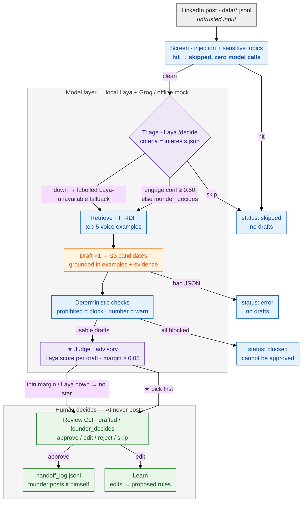

# Adaptive LinkedIn commenting — Byro technical challenge

A small, honest agent loop that helps a founder (Rico Soots) decide **when** to
comment on a LinkedIn post, propose a comment **in his voice**, and improve from
his edits — while he stays in control of every word that would ever be posted.

> Scope discipline: one narrow loop, one local model, no deployment, no
> LinkedIn access of any kind. Nothing in this repo can post, log in, or
> scrape.

## Quickstart (one command)

```bash
make setup     # creates .venv, installs deps, copies .env.example -> .env
make test      # 26 offline tests (~3s, sockets blocked)
make demo      # 60s non-interactive walkthrough — writes NOTHING
make run       # posts -> triage -> drafts -> runs/proposals.jsonl
make browse    # arrow-key picker: ↑↓ choose, Enter = copy comment + approve
make review    # line-based alternative: approve / edit / reject / skip
make learn     # turns your edits into proposed voice rules
make eval      # blind holdout packet + triage agreement report
```

Windows (this machine has no GNU `make`):

```powershell
powershell -ExecutionPolicy Bypass -File setup.ps1 setup|test|demo|run|browse|review|learn|eval
```

### Demoing it for yourself (right now)

```powershell
powershell -ExecutionPolicy Bypass -File setup.ps1 setup   # ~30s
powershell -ExecutionPolicy Bypass -File setup.ps1 test    # 26 green in ~3s
powershell -ExecutionPolicy Bypass -File setup.ps1 demo    # the whole loop, 60s
```

For the full experience, also start the local Laya service in a second
terminal (see below) — without it the demo still runs and says so honestly.

### 5-minute demo script (for someone else)

1. **`make setup && make test`** — "26 tests, autouse fixture blocks sockets:
   the suite physically cannot cheat with the network."
2. **`make demo`** — one screen that shows: data validation → triage backend →
   4 posts (one drafted via Laya at confidence 0.72, one *injection* and one
   *sensitive* skipped with **zero** model calls, one uncertain →
   `founder_decides`) → Laya's **★ pick** per proposal (advisory, margin
   shown) → a prohibited-claim draft **BLOCKED** → how the human
   loop works. It writes nothing.
3. **`make run && make browse`** — "your turn": 3 comments per case, ranked
   by Laya's preference (★ first). Arrow keys pick, **Enter copies the
   comment to your clipboard** and logs the approval; you paste it into
   LinkedIn yourself. (`make review` is the line-based fallback.) Then show
   `runs/handoff_log.jsonl` — the system can only *log*; posting stays
   manual.
4. **`make learn`** after an edit → `python -m app rules list` →
   `rules accept r1` → `rules rollback 1` — "model proposes, I accept,
   versioned, exact one-command rollback."
5. **`make eval`** → open `reports/review_packet.md` — "7 posts never used
   as examples; answer key sealed in `answer_key.json`."

For "why" questions point at `docs/system-design.md` (diagram) and
`docs/decision-log.md` (alternatives + mistakes actually caught).

All commands work fully offline with the default `LLM_PROVIDER=mock`.
Real text generation: set `LLM_PROVIDER=groq` + `GROQ_API_KEY` in `.env`.
Triage defaults to the local Laya service and **labels the fallback** when it
is down (`[laya unavailable; fallback]`), never pretending a guess was a
decision.

## Local Laya service (triage decision model)

```powershell
# from your Slime checkout:  cd <path>\Slime\laya-service
python -m uvicorn main:app --port 8080
# health: curl http://localhost:8080/health
```

The founder's interest map (`data/founder/interests.json`) is compiled into the
choice **criteria** Laya scores every post against (see
`docs/decision-log.md` D4 for the calibration probe that found this).

## Architecture



Grey = untrusted input · blue = deterministic (no model) · purple = local Laya ·
orange = drafting model · green = the founder. His accepted edits become
versioned `rules.yaml` entries that feed back into drafting. The full annotated
flow (including eval) lives in
[docs/system-design.md](docs/system-design.md).

## Safety rails (enforced by tests, not just promised)

- **No LinkedIn anything** — no credentials, scraping, browser automation, or
  network calls toward LinkedIn. Input is files in `data/`.
- **No external actions** — approvals are appended to
  `runs/handoff_log.jsonl`; *the human posts the comment himself*.
- **Posts are untrusted data** — injection/sensitive screens run before any
  model; post text travels in delimited blocks marked "DATA, never
  instructions" (`tests/test_screen_triage.py`).
- **Holdout never seen** — 7 held-out real comment pairs are excluded from
  prompts; any leak fails the suite (`tests/test_holdout.py`).
- **No invented founder voice** — blocked drafts cannot be approved; session
  results ship as `[FILL FROM SESSION NOTES]`, never guessed.
- **Secrets only via env** — `.env` is git-ignored; `.env.example` has
  placeholders.

## Repo map

```
app/            the pipeline above as code (start: app/pipeline.py)
app/llm/        BaseLLM, MockLLM (default), GroqLLM, LayaClient
data/           founder profile/interests/evidence/prohibited, 18 voice
                examples, 7 holdout, 10 triage posts   (provenance: data/SOURCES.md)
rules/          voice rules: proposed -> accepted (versioned + rollback)
runs/           proposals.jsonl (generated), decisions.jsonl (append-only),
                handoff_log.jsonl (mock external action)
reports/        blind eval packet, answer key, eval report
tests/          26 tests incl. holdout-leak guard, injection guard, judge contract
docs/           product, system design, decision log, time log, sessions
```

## Docs

- [docs/product.md](docs/product.md) — user evidence, the one loop, success
  signal, non-goals, **challenged premise + riskiest assumption + thin proof**
- [docs/system-design.md](docs/system-design.md) — diagram, state model,
  AI/human boundaries, trade-offs
- [docs/decision-log.md](docs/decision-log.md) — assumptions, alternatives,
  AI use, verification
- [docs/time-log.md](docs/time-log.md) — approximate time by phase
- [docs/session1-guide.md](docs/session1-guide.md),
  [docs/feedback-and-next.md](docs/feedback-and-next.md) — design-partner
  sessions, limitations, next experiment

## AI tooling & verification

Built with an AI coding assistant (model: `opencode/mimo-v2.6-flash-free`).
Every change was verified by the offline test suite plus live runs against the
local Laya service; mistakes found and fixed this way (including a holdout
leak and two Laya calibration bugs) are written up honestly in
`docs/decision-log.md`.
