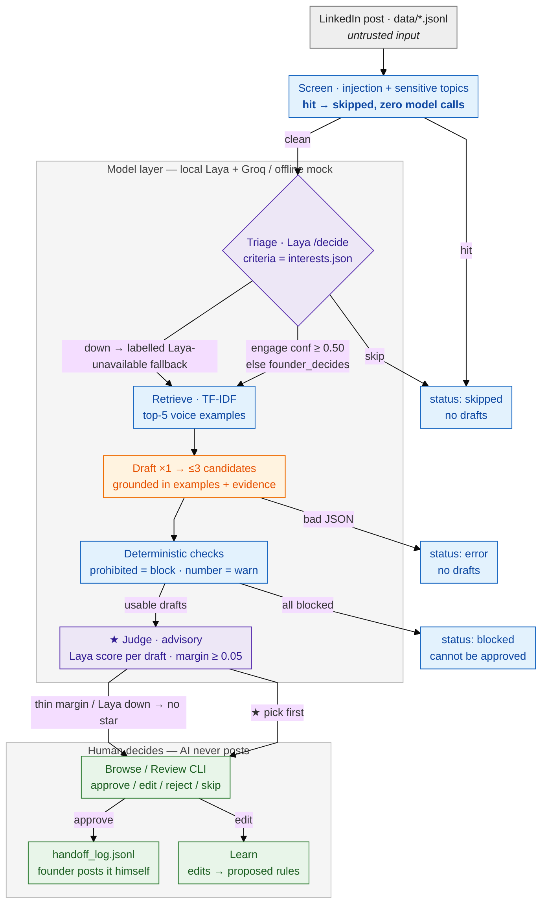

# Adaptive LinkedIn commenting — Byro technical challenge

A small, honest agent loop that helps a founder (Rico Soots) decide **when** to
comment on a LinkedIn post, propose a comment **in his voice**, and improve from
his edits — while he stays in control of every word that would ever be posted.

> Scope discipline: one narrow loop, one local model, no deployment, no
> LinkedIn access of any kind. Nothing in this repo can post, log in, or
> scrape.

## The challenge (brief as issued)

### The challenge

A founder wants to contribute consistently to relevant LinkedIn conversations
without producing generic, inaccurate, repetitive, or obviously AI-generated
comments. Design the smallest coherent product and system that helps them
decide when to engage, propose a useful comment in their voice, and improve
through reviewed feedback while preserving human control. You may challenge
the premise when user evidence supports a better approach.

### What we assess

Problem framing, product judgment, system decomposition, AI engineering
reasoning, technical validation, scope discipline, communication, and
ownership. We do not reward feature quantity, visual polish, a particular
stack, or agreement with an unpublished Byro architecture.

### Time and tools

The total timebox is 10 hours, including the scheduled design-partner sessions
and submission preparation; the later live technical defense is separate. Stop
when time expires, record approximate time by phase, and submit thoughtful
incomplete work rather than hiding extra hours. Use any AI tools that help,
but explain their contribution, mistakes, and your verification. The candidate
invitation will state the model-access arrangement. Candidates will not be
required to purchase a paid service unless Byro separately provides or
explicitly approves that access.

### Your task

1. Understand the user: discover why they engage, what makes a comment
   valuable, what "in my voice" means, and where automation becomes
   uncomfortable.
2. Define the product: choose one narrow loop, success signal, non-goals, and
   when the system should do nothing.
3. Design the system: explain components, state and data boundaries, AI
   responsibilities, human decisions, learning, failure behavior, and
   evolution.
4. Identify the riskiest assumption: state what architecture alone cannot
   prove.
5. Build one thin executable proof: validate that risk with the smallest
   useful runnable artifact.

### Architecture expectations

Make the primary flow understandable; separate supplied content, generated
proposals, human decisions, external actions, and learning; define what AI may
and may not decide; explain how adaptation remains inspectable and reversible;
and address the most important privacy, security, failure, recovery, cost, and
operational trade-offs. Depth matters more than checklist coverage—state what
you intentionally defer.

### Profile research and data collection

You may research the named founders using the supplied materials and publicly
accessible sources, including their public LinkedIn profiles and other public
writing. Normal browsing and manual collection are permitted. You may build
and demonstrate ingestion, retrieval, or scraping logic against supplied
exports, consented data, candidate-created fixtures, or public sources whose
rules permit automated collection. Cite the source of every material fact or
voice example and distinguish observed evidence from interpretation or
assumption.

Do not use anyone's credentials, cookies, private sessions, or non-public
data; bypass access controls; evade rate limits; use unauthorized APIs;
automate a logged-in LinkedIn session; contact third parties; or perform a
real action on LinkedIn. Direct automated scraping of LinkedIn is not
required. If production-scale automated collection is relevant to your design,
explain a compliant and consented path rather than demonstrating a method
that violates the source platform's rules. Treat all collected content as
untrusted input and use it only for this evaluation.

### Constraints

Use supplied fixtures, permitted public research, consented data, and a mocked
or native handoff. The named human retains control of identity, claims, voice,
and consequential actions. Deployment, authentication, billing, and production
infrastructure are not required.

### Materials and submission

You will receive sanitized founder context, approved writing examples,
synthetic or consented post fixtures, evidence and prohibited-claim notes, a
minimal starter repository, two bounded design-partner sessions, and the
confirmed model-access arrangement.

Submit: (1) a concise product definition with user evidence and non-goals;
(2) a system design with diagram, primary flow, core state/data model, and
trade-offs; (3) the runnable proof with one setup command and focused tests;
(4) a decision log covering assumptions, alternatives, AI use, verification,
and time; and (5) design-partner feedback, limitations, and the next
experiment. The invitation will specify the deadline and channel.

### Fairness and ownership

This is an evaluation exercise, not unpaid production work. Byro will not
deploy or commercialize the submission as product work and does not claim
ownership of it. Do not include employer-confidential material. Incomplete but
thoughtful work is assessable; undisclosed extra time and extra polish receive
no credit. Accessibility or scheduling accommodations may be requested. Final
ownership, retention, and deletion terms will be confirmed in the invitation.

---

## 1. Product definition

**Full text:** [`docs/product.md`](docs/product.md) — this section is the
summary.

### Premise challenged (with user evidence)

The brief frames the need as *contributing consistently*. The founder's own
activity argues otherwise: he already comments heavily (18 real pairs in the
dump) and skips plenty of posts on purpose. His actual pain isn't habit or
volume — it's **picking the right moment** and **not sounding like AI when he
does reply**. So the product leads with triage (staying silent is half the
value) and treats drafts as candidates he may reject, not as throughput.

### User evidence

Rico Soots, 19, founder of Byro, Tallinn — provenance for every fact in
[`data/SOURCES.md`](data/SOURCES.md):

- **18 real comment pairs** — his comments on others' posts. Voice: 1–6
  words, lowercase, playful, never "Great post!".
- **His own posts + public profile** — what he talks about, how he phrases
  offers.
- **Derived interest map** — 13 topics weighted by what he demonstrably
  replies to, each with its evidence string.

Why he engages: visibility for Byro, useful to founder peers, hiring, genuine
interest in the Estonian startup scene. Valuable *to him*: short, specific,
adding a real angle — not applause.

### The one narrow loop

```
post in  ->  should he engage?  ->  1-3 draft comments in his voice
          (triage)                     (grounded in his claims + examples)
        ->  the judge stars its style-fit best (★, advisory — accuracy in D10)
        ->  HE approves / edits / rejects  ->  he posts it himself (handoff)
        ->  his edits teach accepted voice rules  ->  better next drafts
```

One post at a time, batch of 10 per run. Nothing else.

### Success signal

1. **Triage agreement** — firm engage/skip calls match his labels;
   *confident-and-wrong* must be 0 (`reports/eval_report.md`).
2. **Blind holdout judgments** — 7 posts he has never seen labeled; answer key
   sealed until he answers (`make eval`).
3. **Edit distance shrinking** — fewer rewrites before approval over sessions;
   his edits become rule-sized, versioned, rollback-able (`make learn`).

### When the system must do nothing

| Condition | Behavior |
|---|---|
| injection / sensitive post | skipped *before* any model sees it |
| model confidence below threshold | `founder_decides` — drafts attached, never auto-picked |
| model error / unparseable JSON | status `error`, **zero drafts** (no guessed text) |
| every draft hits a prohibited-claim block | status `blocked`; blocked drafts cannot be approved |

### Non-goals (explicitly out of scope)

- Auto-posting, scheduling, LinkedIn login/scraping/browsing of any kind
- Multi-user, teams, multi-platform, analytics dashboards
- An "always engage" autopilot — the human decides each time
- Inventing facts or engagement bait — claims must come from the post or
  `evidence.md`
- Production infra: auth, billing, deployment (per brief)

### Riskiest assumption (what architecture alone cannot prove)

> **That a system-drafted comment will read as *him*.** Tests prove the
> screens fire, the holdout never leaks, rules version and roll back — none of
> that proves he'll accept a draft without rewriting it, or can't tell it from
> his own. Voice acceptance is only provable by him, blind. The thin proof:
> `make eval` → `reports/review_packet.md` (7 holdout posts + one of his real
> comments mixed in, answer key sealed).

*Screenshot (to add): the blind holdout packet — drop the file at
`docs/screenshots/review-packet.png`.*

## 2. System design

**Full text:** [`docs/system-design.md`](docs/system-design.md) (diagram,
state model, AI/human boundaries, trade-offs) — this section is the summary.

### The approach, in plain words

All of it starts with what the founder actually does. His real LinkedIn
comments were pulled out **by hand** from the activity dump he gave us — no
scraping, no login, nothing in this repo touches LinkedIn — and they become
the founder's context: examples of how he writes, a map of what he cares
about, and a list of things he never talks about.

That context is fed back into the model in two places, and that's the whole
architectural idea:

1. **His context judges the post.** Instead of asking a model "is this post
   interesting?" in the abstract, we compile his interest map into the
   **criteria** the post is scored against — the local Laya service answers
   "is this something *he* would care about?" and how confidently.
2. **His context writes the comment.** The writing model (Groq's Llama, or
   the offline mock) gets his profile, the claims he's allowed to make, and a
   few of his real comments as style examples, then writes up to three
   candidate replies — each with a response type: a question, an
   acknowledgment, a story.

Then the judge reads the three back and ranks them on one question: *how
familiar does this sound — would he actually type it?* The most familiar one
gets the ★ and jumps to the top of the list. That pick is advisory
(`decision-log.md` D10 publishes exactly how good it actually is); the last
step is always the human — arrow keys, Enter, and the comment lands in his
clipboard to paste into LinkedIn himself.

### Primary flow

1. **Supply** — 10 fixture posts enter as untrusted files (`data/*.jsonl`).
2. **Screen** — deterministic injection + sensitive-topic checks run *before*
   any model; hits are skipped with zero model calls.
3. **Triage** — the local Laya service, scored against criteria compiled from
   his interest map, returns engage / skip / founder_decides + confidence.
4. **Retrieve** — TF-IDF picks up to 5 of his real comments closest to the
   post (the voice examples that will steer drafting).
5. **Draft** — the writing model produces ≤3 candidates (grounded in post +
   evidence; forbidden claims and invented numbers checked deterministically —
   blocking when needed).
6. **Rank** — the judge scores style-fit per candidate; the best gets the ★
   (advisory, margin shown, no star when thin or the service is down).
7. **Decide** — he picks in `browse` (arrows, Enter = copy to clipboard + logged
   approval) or `review` (line-based). Edits become rule proposals (`learn`).
8. **Handoff** — approval is appended to `runs/handoff_log.jsonl`; **he pastes
   it into LinkedIn himself.** Nothing in this repo can post.

### Architecture



Grey = untrusted input · blue = deterministic (no model) · purple = local
Laya · orange = drafting model · green = the founder. His accepted edits
become versioned `rules.yaml` entries that feed back into drafting.

### Core state & data model (all files, all inspectable)

| State | Where | Notes |
|---|---|---|
| `drafted` | `runs/proposals.jsonl` | ≥1 usable draft; ready to decide |
| `founder_decides` | same | confidence thin — drafts attached, never auto-picked |
| `skipped` / `error` / `blocked` | same | zero drafts; nothing to approve |
| decisions (approve/edit/reject/skip) | `runs/decisions.jsonl` | append-only |
| approvals ("handoff") | `runs/handoff_log.jsonl` | the mock external action |
| accepted voice rules | `rules/rules.yaml` | versioned, one-command rollback |
| founder context | `data/founder/*`, `data/voice_examples.jsonl`, 7-item holdout | provenance in `data/SOURCES.md`; holdout never enters prompts (test-enforced) |

### What AI may and may not decide

- **May:** triage suggestion + confidence, draft candidates, style-fit scores
  (★ is advisory), proposed rules from his edits.
- **May not:** post anything, approve anything, decide alone when confidence
  is thin (→ `founder_decides`), touch the holdout, invent claims (blocked
  deterministically).

### Safety rails (enforced by tests, not just promised)

- **No LinkedIn anything** — no credentials, scraping, browser automation, or
  network calls toward LinkedIn. Input is files in `data/`.
- **No external actions** — approvals are appended to
  `runs/handoff_log.jsonl`; *the human posts the comment himself*.
- **Posts are untrusted data** — injection/sensitive screens run before any
  model; post text travels in delimited blocks marked "DATA, never
  instructions" (`tests/test_screen_triage.py`).
- **Holdout never seen** — 7 held-out real comment pairs are excluded from
  prompts; any leak fails the suite (`tests/test_holdout.py`).
- **No invented founder voice** — blocked drafts cannot be approved; session
  results ship as `[FILL FROM SESSION NOTES]`, never guessed.
- **Secrets only via env** — `.env` is git-ignored; `.env.example` has
  placeholders.

### Trade-offs

- **Advisory judge, not auto-select** — the probe behind D10 showed style-fit
  ranking is unreliable (~9/41 vs chance), so the ★ guides instead of
  decides; honest table published rather than hidden.
- **Deterministic screens first** — costs nothing, protects privacy (no model
  call on sensitive posts), and makes skip behavior testable offline.
- **Local Laya for decisions, Groq/mock for text** — decisions stay on-device
  and cheap; text quality is swappable (`LLM_PROVIDER=mock` default keeps the
  whole suite offline and free).
- **Files over a database** — append-only JSONL is inspectable, diffable, and
  rollback-friendly at this scale; a DB would be operational overhead the
  brief doesn't ask for.
- **Mock handoff instead of posting** — safety constraint, not a shortcut.
- **Intentionally deferred:** multi-platform, auth/billing/deployment,
  production-scale LinkedIn collection (a compliant consented path is
  described in `docs/system-design.md` instead of demonstrated), statistics
  beyond one founder and n=7/10.

## 3. Runnable proof

### One setup command

```bash
make setup && make test
```

Windows, no GNU make, no `-ExecutionPolicy` flags — one launcher that
bootstraps `.venv` + `.env` on first use:

```bat
byro.cmd setup   byro.cmd test   byro.cmd demo
byro.cmd run     byro.cmd browse byro.cmd review
```

```bash
make test      # 43 offline tests (~3s, sockets blocked)
make demo      # 60s non-interactive walkthrough — writes NOTHING
make run       # posts -> triage -> drafts -> runs/proposals.jsonl
make browse    # picker: [ Get Response ] -> pick with arrows -> Enter = copy + approve
make review    # line-based alternative: approve / edit / reject / skip
make learn     # turns your edits into proposed voice rules
make eval      # blind holdout packet + triage agreement report
```

### Focused tests (what they actually prove)

`sockets blocked by an autouse fixture` — the suite physically cannot cheat
with the network. 43 tests cover: injection/sensitive screens fire before any
model, holdout leak = failure, blocked drafts cannot be approved, judge
contract (best score wins, thin margin = no star), browse flow (responses
never render before `[ Get Response ]`, copy + approval logging, no
jargon/labels in the demo UI), rules accept/rollback, and eval packet
integrity.

### Demoing it for yourself (right now)

```bat
byro.cmd setup & rem ~30s
byro.cmd test  & rem 43 green in ~3s
byro.cmd demo  & rem the whole loop, 60s
```

For the full experience, also start the local Laya service in a second
terminal (see below) — without it the demo still runs and says so honestly.

### The browse picker (the demoable UI)

Each case shows **the post alone** with a `[ Get Response ]` button — Enter
runs a short loading animation, then reveals three comments ranked by the
judge (★ first). Arrow keys pick; **Enter copies the comment to your
clipboard** (a clear ✓ confirmation block) and logs the approval; you paste it
into LinkedIn yourself. A footer says the posts are canned demo data; the
frames carry no internal model/backend names.

*Screenshot (to add): the picker after responses load — drop the file at
`docs/screenshots/browse-picker.png`.*

*Screenshot (to add): the ✓ "Copied to clipboard" confirmation — drop the
file at `docs/screenshots/browse-copied.png`.*

### Can I test this myself?

Yes — three levels, from zero setup to the full experience:

1. **`byro.cmd setup && byro.cmd test`** — the whole contract in ~3s, offline
   by construction (the suite blocks sockets). Needs nothing else on the
   machine.
2. **`byro.cmd demo`** — the full loop in 60 seconds with mock text and no
   services: screening, triage (honestly labelled fallback when Laya isn't
   running), the ★ step, blocked drafts, the human loop. Writes nothing.
3. **`byro.cmd run && byro.cmd browse`** — real cases, arrow keys, clipboard.
   Also runs without Laya (same honest labels); the ★ scores and rankings
   appear once the local Laya service below is up.

The one piece that doesn't live in this repo is Laya itself — it's a local
service (command below). Everything around it is here and runs as-is.
(`make …` equivalents exist for POSIX reviewers.)

### 5-minute demo script (for someone else)

1. **`make setup && make test`** — "43 tests, autouse fixture blocks sockets:
   the suite physically cannot cheat with the network."
2. **`make demo`** — one screen that shows: data validation → triage backend →
   4 posts (one drafted via Laya at confidence 0.72, one *injection* and one
   *sensitive* skipped with **zero** model calls, one uncertain →
   `founder_decides`) → the judge's **★ pick** per proposal (advisory, margin
   shown) → a prohibited-claim draft **BLOCKED** → how the human loop works.
   It writes nothing.
3. **`make run && make browse`** — "your turn": each case shows the post
   alone with a **[ Get Response ]** button; pressing Enter runs a short
   loading animation, then reveals three comments ranked by the judge (★
   first). Arrow keys pick, **Enter copies the comment to your clipboard**
   (a clear ✓ confirmation block) and logs the approval; you paste it into
   LinkedIn yourself. (`make review` is the line-based fallback.) Then show
   `runs/handoff_log.jsonl` — the system can only *log*; posting stays
   manual.
4. **`make learn`** after an edit → `python -m app rules list` →
   `rules accept r1` → `rules rollback 1` — "model proposes, I accept,
   versioned, exact one-command rollback."
5. **`make eval`** → open `reports/review_packet.md` — "7 posts never used
   as examples; answer key sealed in `answer_key.json`."

For "why" questions point at `docs/system-design.md` (diagram) and
`docs/decision-log.md` (alternatives + mistakes actually caught).

All commands work fully offline with the default `LLM_PROVIDER=mock`.
Real text generation: set `LLM_PROVIDER=groq` + `GROQ_API_KEY` in `.env`.
Triage defaults to the local Laya service and **labels the fallback** when it
is down (`[laya unavailable; fallback]`), never pretending a guess was a
decision.

### Local Laya service (triage + judge model)

```powershell
# from your Slime checkout:  cd <path>\Slime\laya-service
python -m uvicorn main:app --port 8080
# health: curl http://localhost:8080/health
```

The founder's interest map (`data/founder/interests.json`) is compiled into the
choice **criteria** Laya scores every post against (see
`docs/decision-log.md` D4 for the calibration probe that found this).

### Repo map

```
byro.cmd         Windows one-command launcher (bootstrap + any task)
app/            the pipeline above as code (start: app/pipeline.py)
app/llm/        BaseLLM, MockLLM (default), GroqLLM, LayaClient
data/           founder profile/interests/evidence/prohibited, 18 voice
                examples, 7 holdout, 10 triage posts   (provenance: data/SOURCES.md)
rules/          voice rules: proposed -> accepted (versioned + rollback)
runs/           proposals.jsonl (generated), decisions.jsonl (append-only),
                handoff_log.jsonl (mock external action)
reports/        blind eval packet, answer key, eval report
tests/          43 tests incl. holdout-leak, injection, judge + browse contracts
docs/           product, system design, decision log, time log, sessions
```

## 4. Decision log (assumptions, alternatives, AI use, verification, time)

**Full text:** [`docs/decision-log.md`](docs/decision-log.md) (D1–D10: each
with assumptions, alternatives considered, decision, verification) and
[`docs/time-log.md`](docs/time-log.md) (approximate time by phase; total
within the 10h timebox).

Highlights:

- **D4 — triage calibration:** found by probe that Laya must score posts
  against *compiled founder interests*, not a generic prompt; wrong
  calibration was caught live and recorded.
- **D9 — mock drafts are placeholders:** offline text is deliberately
  non-final so nobody mistakes it for a voice claim.
- **D10 — force Laya as judge anyway (against advice):** 8 framings scored
  ≈9/41 correct (below the 33% chance baseline). The founder explicitly chose
  to ship it; guardrails: advisory star only, margin ≥ 0.05, no star when the
  service is down, full probe table published. Wrong confident calls in the
  live run: 0.

### AI use & verification

Built with an AI coding assistant (model: `opencode/mimo-v2.6-flash-free`).
Its contribution, mistakes, and how they were verified:

- Every change was verified by the offline test suite plus live runs against
  the local Laya service.
- Mistakes found and fixed this way — including a holdout leak, two Laya
  calibration bugs, a cp1252 console crash on ★, and a 64-bit ctypes handle
  truncation in the clipboard — are written up honestly in
  `docs/decision-log.md`.
- Time-by-phase recorded in `docs/time-log.md`; no undisclosed extra hours.

## 5. Design-partner feedback, limitations, next experiment

**Full texts:**
[`docs/session1-guide.md`](docs/session1-guide.md) (session script),
[`docs/feedback-and-next.md`](docs/feedback-and-next.md) (verbatim partner
input only), [`reports/session2_results.md`](reports/session2_results.md)
(blind packet results).

> Only verbatim partner input lands in the feedback docs; until a session
> happens every partner field is `[FILL FROM SESSION NOTES]` — no paraphrased
> or imagined reactions.

**Limitations (known now, before the sessions say them):** n is tiny (7
holdout / 10 triage / one founder — directional, not statistical); triage
labels are derived until Session 1 makes them his; thresholds are
probe-calibrated and deliberately *not* tuned on eval labels; default mock
drafts are placeholders (voice quality only measurable with `LLM_PROVIDER=groq`
or in Session 2); the evidence file is a seed awaiting his line-by-line
confirmation; single-platform, single-loop by design, and the loop stops at a
mock handoff.

**Next experiment:** re-calibrate triage on his real Session 1 labels — sweep
`LAYA_CONFIDENCE_THRESHOLD` over {0.40…0.55} on a held-out half of the posts,
pick the point with maximum firm agreement and **zero confident-and-wrong**,
record the addendum either way in D4. Secondary: measure edit-distance before
/after accepted rules to test whether `make learn` actually shrinks his
rewrite work.

## Docs

- [docs/product.md](docs/product.md) — user evidence, the one loop, success
  signal, non-goals, **challenged premise + riskiest assumption + thin proof**
- [docs/system-design.md](docs/system-design.md) — diagram, state model,
  AI/human boundaries, trade-offs
- [docs/decision-log.md](docs/decision-log.md) — assumptions, alternatives,
  AI use, verification
- [docs/time-log.md](docs/time-log.md) — approximate time by phase
- [docs/session1-guide.md](docs/session1-guide.md),
  [docs/feedback-and-next.md](docs/feedback-and-next.md) — design-partner
  sessions, limitations, next experiment
