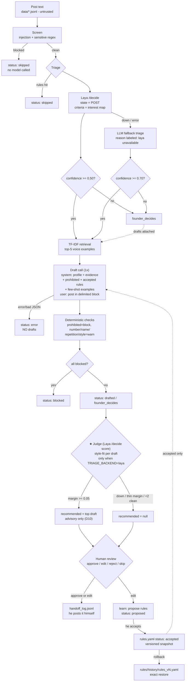

# System design — adaptive LinkedIn commenting

## Primary flow

## Components

| Component | File | Responsibility | AI's role |
|---|---|---|---|
| Screen | `app/screen.py` | injection + sensitive topics | none (deterministic) |
| Triage | `app/triage.py` | engage / skip / founder_decides | Laya choice, or LLM fallback |
| Retrieve | `app/retrieve.py` | top-5 similar voice examples | none (TF-IDF) |
| Draft | `app/draft.py` | up to 3 candidates, strict JSON | Groq Llama or mock |
| Checks | `app/checks.py` | block/warn flags on every draft | none (deterministic) |
| Judge | `app/judge.py` | ★ style-fit recommendation + margin | Laya scores; he still decides (D10) |
| Browse | `app/browse.py` | arrow-key picker: 3 ranked comments, Enter = copy to clipboard + approve | none (UI only) |
| Review | `app/review.py` | approve/edit/reject/skip, append-only | none (recommended draft shown first) |
| Handoff | `app/handoff.py` | mock external action log | none |
| Learn | `app/learn.py` | proposed rules from edits, versioning | proposes; he accepts |
| Eval | `app/eval.py` | blind packet + agreement report | none (he judges) |

## State & data model (files, all inspectable)

| Store | Schema (core fields) | Mutability |
|---|---|---|
| `data/voice_examples.jsonl` | `{id, post_text, founder_comment, topic}` | input, hand-edited |
| `data/holdout.jsonl` | same — **never enters any prompt** | input, sealed |
| `data/triage_posts.jsonl` | `{id, post_text, founder_label, founder_reason}` | labels filled in Session 1 |
| `data/founder/interests.json` | `{interests:[{topic, weight, evidence}], low_signal_topics}` | reweighted after sessions |
| `runs/proposals.jsonl` | `{post_id, post_text, status, screen, triage:{decision,reason,confidence,backend}, drafts:[{id,text,angle,evidence_ids,flags}], reasons, recommended, judge}` | regenerated per run |
| `runs/decisions.jsonl` | `{ts, post_id, draft_id, action, original_text, final_text, reason}` | **append-only** |
| `runs/handoff_log.jsonl` | approval row + `mocked: true` | append-only |
| `rules/rules.yaml` | `{version, rules:[{id, statement, kind, status, params, source_decision_ids}]}` | statuses: proposed/accepted/rejected |
| `rules/history/rules_vN.yaml` | exact snapshot per version | rollback restores byte-for-byte |

Statuses per post: `skipped | founder_decides | drafted | blocked | error`.

## What AI may and may not decide

| AI may | AI may NOT |
|---|---|
| score engage/skip with a confidence | approve its own draft or post it |
| propose ≤3 draft candidates | gate approval — the ★ is advisory, accuracy in D10 |
| star one draft as its style-fit best (he decides) | assert facts beyond post + `evidence.md` |
| propose ≤3 voice rules from *his* edits | activate a rule (only he sets `accepted`) |
| | post, reply, schedule, or log into anything |
| | mark its own eval ("looks good") — he judges blind |

## Failure, recovery, cost

- **Model error / bad JSON** → status `error`, zero drafts. Never a guessed
  comment. `tests/test_screen_triage.py::test_model_error_produces_no_draft`.
- **Laya down or slow** → automatic LLM fallback, reason prefixed
  `[laya unavailable; fallback]`; first call loads the model (~30s) so
  `LAYA_TIMEOUT` must cover it or the label stays honest.
- **Confidence thin** → `founder_decides`, drafts attached for convenience.
  Two thresholds because the two backends' confidence scales differ
  (0.50 Laya probabilities vs 0.70 LLM self-report).
- **Bad rule shipped** → `rules rollback N` restores an exact snapshot
  (`tests/test_rules.py`).
- **Cost/latency** → default run is fully offline (mock). Live: 1 Laya call
  (~2.5s, local, free) per post for triage + 3 judge `score` calls per
  proposal with drafts (~3s each; judge off when `LAYA_JUDGE=off` or backend
  ≠ laya) + 1 draft call per engaging post on Groq (cents per batch).
  Retrieval/checks are local CPU.
- **Privacy** → only public posts he could see anyway; no credentials
  anywhere; `.env` ignored; tests block sockets to prove offline.

## Deliberately deferred (depth over checklist)

- No web UI — interactive CLI review was enough to validate the loop
- No streaming/dedup across runs; no multi-founder config
- Retrieval is TF-IDF, not embeddings (18 examples don't justify more)
- Thresholds calibrated on 5–9 posts; re-calibrate with Session 1 labels
  (see `docs/feedback-and-next.md`)
